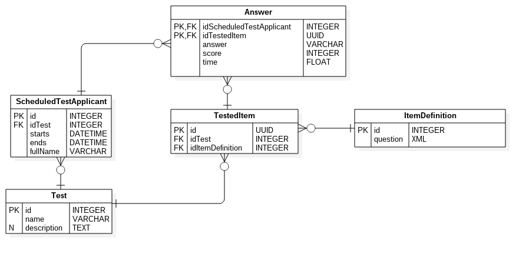
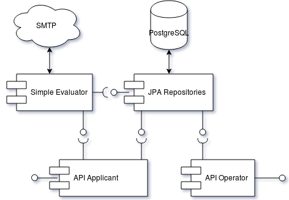

# Examinados, exámenes, preguntas y respuestas

## Modelo ER


### Descripción de las entidades
* ScheduledTestApplicant: Representa la relacion entre un candidato y su prueba agendada
* Test: Representa una prueba que puede ser agendada para su aplicación
* Answer: Es la respuesta de un candidato a un TestedItem específico para la ScheduledTest que le fué asignada
    * answer: Respuesta del candidato
    * score: Calificación asignada según corresponde en ItemDefinition
* TestedItem: Es un elemento que puede tener una respuesta
* ItemDefinition: Es una pregunta que puede ser asociada como TestedItem a un Test
    * question: descripción XML de una pregunta

## Notas sobre el modelo
- Todos los TestedItem que participan en una Test son presentados en su totalidad al candidato.
- Cada TestedItem puede ser respondido por el candidato independientemente de otros TestedItem's

### Tipos de preguntas (ItemDefinition.question)

- Opción múltiple:
 ````xml
 <item>
    <question>
        <description><h1>Select the correct answer<h2><p>Text Body</p></description>
        <body type="multiple-choice">
            <options>
                <option value="a">Option A</option>
                <option value="b">Option B</option>
            </options>
        </body>
    </question>
    <grades>
        <a>10</a>
        <b>1</b>
        <otherwise>0</otherwise>
    </grades>
 </item>
 ````
- Envío de código: *TODO*

## Arquitectura

### Componentes
1. API Operator (REST):
    * Servicios:
        * Crear, Remover y Actualizar Test
        * Crear, Remover y Actualizar ItemDefinition
        * Agregar TestedItem's a Test     
        * Crear y cancelar un ScheduledTestApplicant 
        * Previsualizar ScheduledTestApplicant
2. JPA Repositories
    * Almacenamiento
2. Simple Evaluator
    * Servicios
        * Evaluación de pruebas
        * Envío de resultados por SMTP
3. API Applicant (REST)
    * Servicios:
        * Terminar/Enviar Test


## Estrategias de evaluación/calificación

- Cada pregunta tendrá un mapa de respuestas y calificaciones.

- Dado que la entidad Answer tiene la opción seleccionada por el TestApplicant sólo es cuestión de verificar qué calificación le corresponde a esa respuesta según lo espeficado en la columna question de la entidad ItemDefinition.